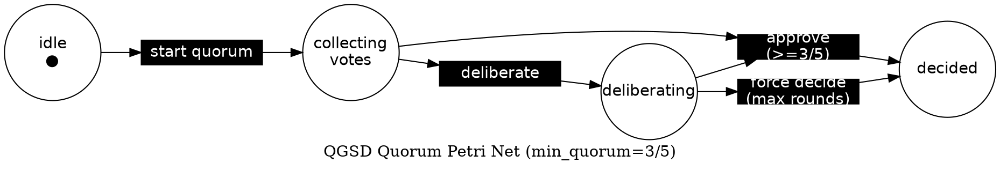
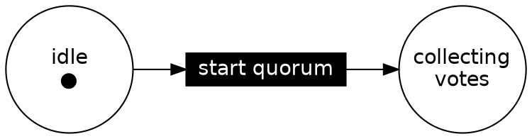

# Phase v0.12-03: Static Analysis Suite — Research

**Researched:** 2026-02-25
**Domain:** Alloy 6 formal modeling, PRISM probabilistic model checking, Petri Net DOT generation, @hpcc-js/wasm-graphviz, Node.js JVM-gated CLI wrappers
**Confidence:** HIGH (Alloy/Petri) | MEDIUM (PRISM constant-file pattern — no "pass a .const file" mechanism exists; constants are inline -const flags)

---

<phase_requirements>
## Phase Requirements

| ID | Description | Research Support |
|----|-------------|-----------------|
| ALY-01 | Developer can find `.formal/alloy/quorum-votes.als` — vote-counting predicates using `pred` (not `fact`) to enable counterexample generation | Alloy 6.2 `pred` + `check` assertion syntax; `NoSpuriousApproval` modeled as `assert` checked via `check` command; `pred` keeps predicates advisory so counterexamples can be found |
| ALY-02 | Developer can run `bin/run-alloy.cjs` to invoke Alloy 6 JAR headless; gated on `JAVA_HOME` | Alloy 6.2 CLI: `java -jar org.alloytools.alloy.dist.jar exec -o - -t text <file.als>`; JAVA_HOME gate follows same pattern as `run-tlc.cjs` |
| PRM-01 | Developer can find `.formal/prism/quorum.pm` — DTMC model of quorum convergence with transition probabilities | PRISM DTMC `dtmc` keyword; module with probabilistic transitions; `const double` declarations for TP/TN rates |
| PRM-02 | Developer can run `bin/export-prism-constants.cjs` to read scoreboard TP/TN/UNAVAIL data and export empirical rates as a `.const` file for PRISM | Scoreboard `rounds[]` array has `votes` per model with `TP`/`TN`/`UNAVAIL` etc.; empirical rates computed per model slot; output file is a valid PRISM model snippet (`const double ...;` lines) that can be pasted into `quorum.pm` |
| PRM-03 | Rate exporter warns and uses conservative priors when scoreboard has fewer than 30 rounds per slot | 30-round threshold is a project-specific constant; warning to stderr; prior values hard-coded (TP_PRIOR=0.85, UNAVAIL_PRIOR=0.15) |
| PET-01 | Developer can run `bin/generate-petri-net.cjs` to emit a Graphviz DOT file of the quorum token-passing net | Petri Net DOT format: bipartite digraph with `circle` places and `rect` transitions; standard graphviz DOT syntax |
| PET-02 | `generate-petri-net.cjs` renders DOT to SVG via `@hpcc-js/wasm-graphviz` (no system Graphviz install required) | `@hpcc-js/wasm-graphviz` v2.33.0; async `Graphviz.load()` pattern; ESM module (needs dynamic import in CJS context) |
| PET-03 | Script emits a structural deadlock warning if `min_quorum_size > available_slots` (net can never fire) | Pure logic check before rendering; `min_quorum_size` from REQUIREMENTS.md quorum threshold; compare against available model slots |
</phase_requirements>

---

## Summary

This phase adds three formal verification artifacts — an Alloy relational model, a PRISM probabilistic model, and a Petri Net token model — plus the Node.js CLI scripts to invoke them. All three tools share Java >=17 as a prerequisite (Alloy and PRISM are JVM tools), but the Petri Net generation is pure Node.js using `@hpcc-js/wasm-graphviz`. The phase also consolidates the shared Java prerequisite documentation into a single `VERIFICATION_TOOLS.md` file covering TLA+, Alloy, and PRISM.

The Alloy model (`.formal/alloy/quorum-votes.als`) uses `pred`-based vote-counting predicates rather than `facts`. This is the critical architectural choice: `fact` in Alloy constrains the model globally so that non-conforming states are never generated, making counterexample generation impossible for those properties. Using `pred` keeps the vote-counting logic as an assertion target — the `check NoSpuriousApproval` command instructs Alloy to actively search for a counterexample. If no counterexample is found within the given scope, Alloy reports the assertion may be valid. The `run-alloy.cjs` wrapper invokes Alloy 6.2's headless subcommand with `--output - --type text`.

The PRISM model (`.formal/prism/quorum.pm`) is a Discrete-Time Markov Chain (DTMC) with constants for TP/TN/UNAVAIL rates. PRISM does not support a separate "const file" import — the `-const` flag on the command line injects constants inline. The `export-prism-constants.cjs` script reads the scoreboard's per-round vote data, computes empirical rates per slot, and writes a valid PRISM snippet file (a series of `const double ...;` declarations) that a developer can paste into `quorum.pm`. This pattern satisfies PRM-02/PRM-03 without requiring a PRISM file-include mechanism that does not exist.

The Petri Net generation (`bin/generate-petri-net.cjs`) uses `@hpcc-js/wasm-graphviz` v2.33.0 — a WASM-compiled Graphviz that requires no system Graphviz install. The package is ESM-primary; using it from a `.cjs` script requires a dynamic `import()`. The deadlock warning (PET-03) is a pure structural check before rendering: if `min_quorum_size > available_slots`, the quorum transition can never fire (it needs more tokens than places can provide).

**Primary recommendation:** Implement in order: (1) `quorum-votes.als` + `run-alloy.cjs`, (2) `quorum.pm` + `export-prism-constants.cjs`, (3) `generate-petri-net.cjs`, (4) `VERIFICATION_TOOLS.md`. All JVM-gated scripts follow the `run-tlc.cjs` pattern exactly.

---

## Standard Stack

### Core
| Tool | Version | Purpose | Why Standard |
|------|---------|---------|--------------|
| Alloy 6.2 JAR | v6.2.0 (Jan 2025) | Relational model checker — SAT-based counterexample search for structural properties | Only Alloy 6 supports temporal model-checking; `pred`/`check` is the canonical Alloy correctness pattern |
| PRISM | 4.8.x (latest) | DTMC probabilistic model checker — computes reachability/convergence probabilities | Industry standard for probabilistic model checking; Java-based, no alternative in same class |
| `@hpcc-js/wasm-graphviz` | 2.33.0 (Feb 2026) | WASM-compiled Graphviz — DOT to SVG with no system install | Eliminates system Graphviz dependency; pure npm; actively maintained |
| Java | >=17 | JVM runtime for Alloy and PRISM | Shared prerequisite with TLA+; already required by `run-tlc.cjs` |
| Node.js built-ins (`child_process`, `fs`, `path`) | Node >=16.7 | JVM invocation wrappers | Zero-dep constraint; matches all other QGSD bin/ scripts |
| `node:test` | built-in | Unit tests for all three bin/ scripts | Project-standard test framework |

### Supporting
| Tool | Version | Purpose | When to Use |
|------|---------|---------|-------------|
| SAT4J (bundled in Alloy JAR) | bundled | Default SAT solver for Alloy | Default — no separate install needed |
| PRISM `-const` flag | built-in | Inject constants from CLI | Used in VERIFICATION_TOOLS.md to explain how to override rates from the exported `.const` snippet |

### Alternatives Considered
| Instead of | Could Use | Tradeoff |
|------------|-----------|----------|
| `@hpcc-js/wasm-graphviz` | `graphviz` npm package (system Graphviz wrapper) | System Graphviz install required; breaks on machines without it; violates PET-02 requirement |
| `@hpcc-js/wasm-graphviz` | `d3-graphviz` | Browser-oriented; requires DOM; not suitable for CLI Node.js output to file |
| PRISM binary script | PRISM Java API directly | Java API requires classpath setup and is complex; `bin/prism` shell script is simpler to invoke via spawnSync |
| Alloy headless subcommand | Alloy Java API (ExampleCompilingFromSource) | Java API requires classpath setup and error handling; headless subcommand is simpler and maps to the run-tlc.cjs pattern |

**Installation:**
```bash
# Alloy 6.2.0 JAR (once, after cloning — gitignored like tla2tools.jar)
curl -L https://github.com/AlloyTools/org.alloytools.alloy/releases/download/v6.2.0/org.alloytools.alloy.dist.jar \
     -o .formal/alloy/org.alloytools.alloy.dist.jar

# PRISM binary (once, per platform) — download from prismmodelchecker.org
# Then set PRISM_BIN=/path/to/prism/bin/prism

# @hpcc-js/wasm-graphviz (npm devDependency)
npm install --save-dev @hpcc-js/wasm-graphviz
```

---

## Architecture Patterns

### Recommended Project Structure
```
.formal/
├── alloy/
│   ├── .gitkeep                        # track empty directory
│   └── quorum-votes.als                # ALY-01: Alloy spec with pred + check
├── prism/
│   ├── .gitkeep                        # track empty directory
│   └── quorum.pm                       # PRM-01: DTMC model
│   (rates.const — gitignored, generated by export-prism-constants.cjs)
├── petri/
│   (quorum-petri-net.dot — gitignored or committed as docs)
│   (quorum-petri-net.svg — gitignored or committed as docs)
└── tla/                                # exists from v0.12-02
    ├── QGSDQuorum.tla
    ├── MCsafety.cfg
    └── MCliveness.cfg
bin/
├── run-alloy.cjs                       # ALY-02: invokes Alloy JAR
├── run-alloy.test.cjs                  # tests (no Java required)
├── export-prism-constants.cjs          # PRM-02/03: scoreboard -> .const
├── export-prism-constants.test.cjs
├── generate-petri-net.cjs              # PET-01/02/03: DOT + SVG
└── generate-petri-net.test.cjs
VERIFICATION_TOOLS.md                   # single Java prereq doc for TLA+, Alloy, PRISM
```

### Pattern 1: Alloy Spec with pred (not fact) for Vote-Counting (ALY-01)

**What:** An Alloy module using `pred` to express vote-counting constraints so the `check` command can find counterexamples.
**When to use:** Whenever a property needs to be *checked* rather than *assumed*. Facts make properties globally true — counterexample generation is impossible for them.

```alloy
-- .formal/alloy/quorum-votes.als
-- Source: alloy.readthedocs.io/en/latest/language/predicates-and-functions.html
-- Alloy 6: pred vs fact distinction

module quorum_votes

-- Signatures
sig Agent {}

sig VoteRound {
    approvals : set Agent,
    total     : one Int
}

-- Predicates (not facts) — enable check commands to find counterexamples
-- If these were "fact", check would trivially pass (no counterexamples possible)
pred MajorityReached [r : VoteRound] {
    -- mul avoids integer division: #approvals * 2 >= total
    mul[#r.approvals, 2] >= r.total
}

pred ValidRound [r : VoteRound] {
    r.total > 0
    r.total = #Agent
    #r.approvals <= r.total
}

-- Assertion: no round can pass without majority
assert NoSpuriousApproval {
    all r : VoteRound |
        (ValidRound[r] and not MajorityReached[r])
            implies (mul[#r.approvals, 2] < r.total)
}

-- Check the assertion for scope 5 agents, 5 rounds
check NoSpuriousApproval for 5 Agent, 5 VoteRound
```

**Key design decisions:**
- `pred MajorityReached` — not `fact` — so `check NoSpuriousApproval` can search for violations
- `assert NoSpuriousApproval` is the target of `check` — Alloy returns "No counterexample found" or shows a counterexample instance
- Scope `for 5 Agent, 5 VoteRound` bounds the search (matches QGSD's 5 quorum slots)
- `mul[#r.approvals, 2]` avoids integer division — same pattern as TLA+ `successCount * 2 >= N` from v0.12-02 research

### Pattern 2: Alloy 6.2 Headless JAR Invocation (ALY-02)

**What:** `run-alloy.cjs` follows the exact same JAVA_HOME gate + spawnSync pattern as `run-tlc.cjs`.

**Alloy 6.2 headless invocation via spawnSync:**
```javascript
// Source: AlloyTools discourse.group + README
// JAR subcommand for headless analysis is the second positional arg to java -jar
const result = spawnSync(javaExe, [
  '-jar', jarPath,
  'exec',            // Alloy 6.2 CLI subcommand name (a string arg, not Node.js exec)
  '--output', '-',   // send results to stdout
  '--type', 'text',  // human-readable output
  '--quiet',         // suppress progress messages
  alsPath,
], { encoding: 'utf8', stdio: 'inherit' });
```

**Available Alloy 6.2 subcommand options (verified from discourse thread):**
- `-c, --command <string>` — run only commands matching pattern (default: all)
- `-o, --output <string>` — output directory or `-` for stdout
- `-t, --type text|json|xml|table|none` — output format
- `-q, --quiet` — suppress progress messages
- `-s, --solver <string>` — SAT solver (default: SAT4J, no install needed)
- `-r, --repeat <int>` — find multiple solutions

**run-alloy.cjs structure (mirrors run-tlc.cjs exactly):**
```javascript
#!/usr/bin/env node
'use strict';
// bin/run-alloy.cjs
// Invokes Alloy 6 JAR for QGSD vote-counting model.
// Requirements: ALY-02
const { spawnSync } = require('child_process');
const fs   = require('fs');
const path = require('path');

// Step 1: JAVA_HOME gate (identical to run-tlc.cjs)
const JAVA_HOME = process.env.JAVA_HOME;
let javaExe;
if (JAVA_HOME) {
  javaExe = path.join(JAVA_HOME, 'bin', 'java');
  if (!fs.existsSync(javaExe)) {
    process.stderr.write('[run-alloy] JAVA_HOME set but java not found at: ' + javaExe + '\n');
    process.exit(1);
  }
} else {
  const probe = spawnSync('java', ['--version'], { encoding: 'utf8' });
  if (probe.error || probe.status !== 0) {
    process.stderr.write('[run-alloy] Java not found. Install Java >=17. https://adoptium.net/\n');
    process.exit(1);
  }
  javaExe = 'java';
}

// Step 2: Java >=17 check (same regex as run-tlc.cjs)
const versionOutput = spawnSync(javaExe, ['--version'], { encoding: 'utf8' }).stdout + '';
const javaMajor = parseInt((versionOutput.match(/(?:openjdk\s+|java version\s+[""]?)(\d+)/i) || [])[1], 10) || 0;
if (javaMajor < 17) {
  process.stderr.write('[run-alloy] Java >=17 required. https://adoptium.net/\n');
  process.exit(1);
}

// Step 3: Locate Alloy JAR
const jarPath = path.join(__dirname, '..', 'formal', 'alloy', 'org.alloytools.alloy.dist.jar');
if (!fs.existsSync(jarPath)) {
  process.stderr.write(
    '[run-alloy] Alloy JAR not found at: ' + jarPath + '\n' +
    '[run-alloy] Download v6.2.0:\n' +
    '  curl -L https://github.com/AlloyTools/org.alloytools.alloy/releases/download/v6.2.0/org.alloytools.alloy.dist.jar \\\n' +
    '       -o .formal/alloy/org.alloytools.alloy.dist.jar\n'
  );
  process.exit(1);
}

// Step 4: Invoke Alloy headlessly via spawnSync
const alsPath = path.join(__dirname, '..', 'formal', 'alloy', 'quorum-votes.als');
const result = spawnSync(javaExe, [
  '-jar', jarPath,
  'exec', '--output', '-', '--type', 'text', '--quiet',
  alsPath,
], { encoding: 'utf8', stdio: 'inherit' });

if (result.error) {
  process.stderr.write('[run-alloy] JAR invocation failed: ' + result.error.message + '\n');
  process.exit(1);
}
process.exit(result.status || 0);
```

### Pattern 3: PRISM DTMC Model (PRM-01)

**What:** A DTMC (Discrete-Time Markov Chain) in PRISM's native format modeling quorum convergence.
**Key facts:**
- PRISM DTMC files conventionally use `.pm` extension
- Start with `dtmc` keyword
- `const double` declarations for transition probabilities — these are replaced by values from `export-prism-constants.cjs` output
- Module has an integer state variable and probabilistic commands

```prism
// .formal/prism/quorum.pm
// Source: prismmodelchecker.org/manual/ThePRISMLanguage/AllOnOnePage
// DTMC model of QGSD quorum convergence

dtmc

// Slot TP rates: probability a slot votes APPROVE
// Override via: prism quorum.pm -pf "..." -const tp_rate=0.9274 -const unavail=0.0215
// Or paste empirical values from rates.const (generated by bin/export-prism-constants.cjs)
const double tp_rate   = 0.85;   // conservative prior
const double unavail   = 0.15;   // P(slot UNAVAILABLE in a given round)

// States: 0=COLLECTING_VOTES, 1=DECIDED, 2=DELIBERATING
module quorum_convergence
    s : [0..2] init 0;

    // From COLLECTING_VOTES: majority reached -> DECIDED; else -> DELIBERATING
    [] s=0 -> (tp_rate * (1 - unavail)) : (s'=1)
            + (1 - tp_rate * (1 - unavail)) : (s'=2);

    // From DELIBERATING: retry with same probabilities
    [] s=2 -> (tp_rate * (1 - unavail)) : (s'=1)
            + (1 - tp_rate * (1 - unavail)) : (s'=2);

    // DECIDED is absorbing
    [] s=1 -> 1.0 : (s'=1);

endmodule

// Query: P=? [ F s=1 ]
// Run: prism .formal/prism/quorum.pm -pf "P=? [ F s=1 ]"
```

### Pattern 4: PRISM Constants Export (PRM-02/PRM-03)

**What:** `export-prism-constants.cjs` reads `.planning/quorum-scoreboard.json`, computes per-slot empirical TP/TN/UNAVAIL rates from round data, and writes a PRISM constants snippet file.

**Critical finding:** PRISM has no "include" or "file import" mechanism. The `.const` output file is a snippet of valid PRISM declarations that a developer copies into `quorum.pm` or injects via `-const key=value` CLI flags. The file name `rates.const` signals its purpose but is NOT a special PRISM file type.

**Scoreboard data structure (verified from codebase):**
```javascript
// .planning/quorum-scoreboard.json round structure:
{
  "rounds": [
    {
      "date": "02-21", "task": "quick-2: R3.6 rule", "round": 1,
      "votes": { "claude": "TP", "codex": "UNAVAIL", "gemini": "TP+", "opencode": "TP" },
      "verdict": "APPROVE"
    }
    // 423 rounds as of 2026-02-25
  ]
}
```

**export-prism-constants.cjs key logic:**
```javascript
// bin/export-prism-constants.cjs
'use strict';
const fs   = require('fs');
const path = require('path');

const MIN_ROUNDS    = 30;     // PRM-03: warn if fewer rounds
const TP_PRIOR      = 0.85;   // conservative prior
const UNAVAIL_PRIOR = 0.15;   // conservative prior

const scoreboardPath = path.join(process.cwd(), '.planning', 'quorum-scoreboard.json');
const outputPath     = path.join(process.cwd(), 'formal', 'prism', 'rates.const');

if (!fs.existsSync(scoreboardPath)) {
  process.stderr.write('[export-prism-constants] No scoreboard at: ' + scoreboardPath + '\n');
  process.exit(1);
}

const data   = JSON.parse(fs.readFileSync(scoreboardPath, 'utf8'));
const rounds = data.rounds || [];
const slots  = ['gemini', 'opencode', 'copilot', 'codex'];

const lines  = ['// PRISM rate constants — generated by bin/export-prism-constants.cjs'];
lines.push('// Source: .planning/quorum-scoreboard.json (' + rounds.length + ' rounds)');
lines.push('// Paste these lines into .formal/prism/quorum.pm to override the default priors.');
lines.push('');

for (const slot of slots) {
  const slotRounds = rounds.filter(r => r.votes && r.votes[slot] !== undefined);
  const n     = slotRounds.length;
  const tps   = slotRounds.filter(r => ['TP', 'TP+'].includes(r.votes[slot])).length;
  const unavs = slotRounds.filter(r => r.votes[slot] === 'UNAVAIL').length;

  if (n < MIN_ROUNDS) {
    process.stderr.write(
      '[export-prism-constants] WARNING: slot "' + slot + '" has ' + n +
      ' rounds (< ' + MIN_ROUNDS + '). Using conservative priors.\n'
    );
    lines.push('// ' + slot + ': n=' + n + ' rounds — using priors (< ' + MIN_ROUNDS + ' threshold)');
    lines.push('const double tp_' + slot + ' = ' + TP_PRIOR + ';');
    lines.push('const double unavail_' + slot + ' = ' + UNAVAIL_PRIOR + ';');
  } else {
    lines.push('// ' + slot + ': n=' + n + ' rounds (empirical)');
    lines.push('const double tp_' + slot + ' = ' + (tps / n).toFixed(4) + ';');
    lines.push('const double unavail_' + slot + ' = ' + (unavs / n).toFixed(4) + ';');
  }
  lines.push('');
}

fs.mkdirSync(path.dirname(outputPath), { recursive: true });
fs.writeFileSync(outputPath, lines.join('\n'));
process.stdout.write('[export-prism-constants] Written: ' + outputPath + '\n');
```

### Pattern 5: Petri Net DOT Generation and SVG Rendering (PET-01/02/03)

**What:** `generate-petri-net.cjs` emits a bipartite DOT graph for the quorum token-passing model and renders it to SVG via `@hpcc-js/wasm-graphviz`.

**Petri Net structure for QGSD quorum:**
- Places (circles): `idle`, `collecting_votes`, `deliberating`, `decided`
- Transitions (rectangles): `t_start_quorum`, `t_approve`, `t_deliberate`, `t_force_decide`
- Arcs: directed edges between places and transitions (bipartite — no place-to-place or transition-to-transition)

**DOT format for Petri nets:**


**@hpcc-js/wasm-graphviz in a CJS script — ESM import via dynamic import():**
```javascript
// bin/generate-petri-net.cjs
// @hpcc-js/wasm-graphviz v3.x is ESM-primary — use dynamic import() from CJS
'use strict';
const fs   = require('fs');
const path = require('path');

const QUORUM_SLOTS    = ['gemini', 'opencode', 'copilot', 'codex', 'claude'];
const MIN_QUORUM_SIZE = Math.ceil(QUORUM_SLOTS.length / 2);

// PET-03: structural deadlock check (pure logic, before any rendering)
if (MIN_QUORUM_SIZE > QUORUM_SLOTS.length) {
  process.stderr.write(
    '[generate-petri-net] WARNING: Structural deadlock detected.\n' +
    '[generate-petri-net] min_quorum_size (' + MIN_QUORUM_SIZE + ') > ' +
    'available_slots (' + QUORUM_SLOTS.length + ').\n' +
    '[generate-petri-net] Quorum transition can never fire.\n'
  );
  // Do not exit — still emit the net for documentation purposes
}

function buildDot(slots, minQuorum) {
  return [
    'digraph quorum_petri_net {',
    '  rankdir=LR;',
    '  label="QGSD Quorum Petri Net (min_quorum=' + minQuorum + '/' + slots.length + ')";',
    '  node [fontname="Helvetica"];',
    '  node [shape=circle, fixedsize=true, width=1.2];',
    '  idle         [label="idle\\n\u25CF"];',
    '  collecting   [label="collecting\\nvotes"];',
    '  deliberating [label="deliberating"];',
    '  decided      [label="decided"];',
    '  node [shape=rect, height=0.3, width=1.5, style=filled, fillcolor=black, fontcolor=white];',
    '  t_start      [label="start quorum"];',
    '  t_approve    [label="approve\\n(>=' + minQuorum + '/' + slots.length + ')"];',
    '  t_deliberate [label="deliberate"];',
    '  t_force      [label="force decide\\n(max rounds)"];',
    '  idle -> t_start; t_start -> collecting;',
    '  collecting -> t_approve; collecting -> t_deliberate;',
    '  t_approve -> decided;',
    '  t_deliberate -> deliberating;',
    '  deliberating -> t_approve; deliberating -> t_force;',
    '  t_force -> decided;',
    '}',
  ].join('\n');
}

const dotContent = buildDot(QUORUM_SLOTS, MIN_QUORUM_SIZE);
const outDir     = path.join(process.cwd(), 'formal', 'petri');
const dotPath    = path.join(outDir, 'quorum-petri-net.dot');
const svgPath    = path.join(outDir, 'quorum-petri-net.svg');

fs.mkdirSync(outDir, { recursive: true });
fs.writeFileSync(dotPath, dotContent);
process.stdout.write('[generate-petri-net] DOT written to: ' + dotPath + '\n');

// PET-02: render via WASM Graphviz — dynamic import() from CJS
(async () => {
  let Graphviz;
  try {
    ({ Graphviz } = await import('@hpcc-js/wasm-graphviz'));
  } catch (importErr) {
    process.stderr.write(
      '[generate-petri-net] @hpcc-js/wasm-graphviz not installed.\n' +
      '[generate-petri-net] Run: npm install --save-dev @hpcc-js/wasm-graphviz\n'
    );
    process.exit(1);
  }
  try {
    const graphviz = await Graphviz.load();
    const svg      = graphviz.dot(dotContent);
    fs.writeFileSync(svgPath, svg);
    process.stdout.write('[generate-petri-net] SVG written to: ' + svgPath + '\n');
  } catch (renderErr) {
    process.stderr.write('[generate-petri-net] SVG render failed: ' + renderErr.message + '\n');
    process.exit(1);
  }
})();
```

### Anti-Patterns to Avoid

- **Using `fact` instead of `pred` for vote-counting predicates in Alloy:** `fact` in Alloy makes a constraint globally true and filters out all non-conforming models before checking. This makes it impossible for `check` to find counterexamples to those constraints. Always use `pred` for properties that should be verified by `check`.
- **Asserting properties inside `pred` in Alloy:** `assert` must be a top-level declaration; it cannot be nested in `pred`. Use `assert Name { ... }` at module level, then `check Name for N`.
- **Assuming PRISM supports a file-include mechanism for constants:** PRISM has no `include` or `import` statement. The `rates.const` output is a human-readable snippet to copy/paste or inject via multiple `-const key=value` CLI flags.
- **Using synchronous Graphviz in `@hpcc-js/wasm-graphviz`:** The library has no synchronous API. Always use `await Graphviz.load()`.
- **Using `require()` for `@hpcc-js/wasm-graphviz` in CJS:** The package is ESM-primary at v3.x. Use `await import(...)` inside an async IIFE.
- **Emitting exit code 1 for the PET-03 structural deadlock warning:** PET-03 says "emits a warning" — print to stderr and continue. The net is still useful for documentation even if unfirable.
- **Invoking PRISM as `java -jar prism.jar`:** PRISM ships a shell script (`bin/prism`) that sets up JNI native libraries. Always invoke the shell script, not the JAR directly.

---

## Don't Hand-Roll

| Problem | Don't Build | Use Instead | Why |
|---------|-------------|-------------|-----|
| SAT-based structural property checking | Manual graph traversal of vote states | Alloy 6 `check` command | SAT solving handles all state combinations within scope; manual traversal misses edge cases |
| DOT-to-SVG rendering | `spawnSync('dot', ...)` on system Graphviz | `@hpcc-js/wasm-graphviz` | System Graphviz not available everywhere; WASM eliminates the install requirement (PET-02 requirement) |
| Probabilistic convergence analysis | Manual Monte Carlo simulation | PRISM DTMC | PRISM solves the Markov chain exactly; no sampling error |
| Java version parsing | Ad-hoc string split | Regex against `java --version` output | Already established in `run-tlc.cjs` — copy exactly |
| Petri Net bipartite structure | Custom adjacency list | Standard DOT digraph with `shape=circle` and `shape=rect` | DOT handles layout automatically; Graphviz places nodes correctly |

**Key insight:** All three formal tools (Alloy, PRISM, Petri+Graphviz) encode decades of research into counterexample search, probabilistic analysis, and graph layout. The wrapper scripts' only job is invocation, error reporting, and data export.

---

## Common Pitfalls

### Pitfall 1: Alloy `fact` vs `pred` for verifiable properties
**What goes wrong:** Using `fact` for vote-counting predicates causes `check` commands to trivially succeed — the fact constrains away all non-conforming instances, so no counterexamples exist by construction, not by verification.
**Why it happens:** `fact` looks similar to `pred` syntactically; the distinction is semantically significant but easy to miss.
**How to avoid:** Use `pred` for all vote-counting constraints. Only use `fact` for structural constraints that are invariants of the model itself (e.g., "VoteRound.total = #Agent" as a typing constraint).
**Warning signs:** `check` command reports "No counterexample found" immediately on all assertions, even for clearly incorrect properties.

### Pitfall 2: PRISM `-const` flag syntax vs "const file" assumption
**What goes wrong:** Developer expects PRISM to support a `-constfile rates.const` option — no such flag exists. PRISM only accepts inline `-const key=value` pairs.
**Why it happens:** The requirement says "exports...a `.const` file for PRISM" — this is a QGSD-invented convention, not a PRISM file type.
**How to avoid:** The `rates.const` file is a snippet of valid PRISM `const double ...;` declarations. The developer workflow is: (1) run `export-prism-constants.cjs` to generate `rates.const`, (2) copy the constants into `quorum.pm` or use them as `-const tp_gemini=0.9274 -const unavail_gemini=0.0215` CLI flags. Document this clearly in `VERIFICATION_TOOLS.md`.
**Warning signs:** "Unknown option '-constfile'" error when running PRISM.

### Pitfall 3: @hpcc-js/wasm-graphviz CJS import failure
**What goes wrong:** `const { Graphviz } = require('@hpcc-js/wasm-graphviz')` fails with "ERR_REQUIRE_ESM" at Node.js 22+.
**Why it happens:** `@hpcc-js/wasm-graphviz` v3.x is ESM-only. Node.js refuses to synchronously `require()` an ESM module.
**How to avoid:** Use `await import('@hpcc-js/wasm-graphviz')` inside an `async` function or top-level async IIFE. This works in `.cjs` files.
**Warning signs:** `ERR_REQUIRE_ESM` error at the require() line.

### Pitfall 4: Alloy check exit code interpretation
**What goes wrong:** Treating Alloy's exit code as a pass/fail result — Alloy 6 exits 0 even when counterexamples are found; the result is in stdout/text output.
**Why it happens:** Alloy is primarily a GUI tool; exit codes are not as clearly documented as TLC's.
**How to avoid:** After spawnSync, scan `result.stdout` for "Counterexample found" vs "No counterexample found". Parse the text output, not just the exit code. The `run-alloy.cjs` script should detect counterexamples in stdout and set its own exit code accordingly.
**Warning signs:** `run-alloy.cjs` exits 0 but `check` found a counterexample (silent failure indicating a bug in quorum-votes.als).

### Pitfall 5: PRISM requires shell script invocation, not java -jar
**What goes wrong:** Trying to invoke PRISM as `java -jar prism.jar ...` fails — PRISM's distribution ships a shell script (`bin/prism`) that sets up classpath, native libraries, and JVM args.
**Why it happens:** PRISM uses JNI for native solvers; plain JAR invocation doesn't set up the library path.
**How to avoid:** Invoke PRISM via the `bin/prism` shell script (PATH lookup or `PRISM_BIN` environment variable pointing to the full path of the `prism` script). `export-prism-constants.cjs` only writes a file — it doesn't invoke PRISM. Add to `VERIFICATION_TOOLS.md`: set `PRISM_BIN` and run `$PRISM_BIN .formal/prism/quorum.pm -pf 'P=? [ F s=1 ]'`.
**Warning signs:** `UnsatisfiedLinkError` or "Cannot find native library" when running `java -jar prism.jar`.

### Pitfall 6: Alloy JAR size and gitignore
**What goes wrong:** Committing `org.alloytools.alloy.dist.jar` to git — it is ~50MB+, similar to `tla2tools.jar`.
**Why it happens:** Developers may follow the commit-vs-gitignore pattern without checking size.
**How to avoid:** Add `.formal/alloy/org.alloytools.alloy.dist.jar` to `.gitignore`. Print the download command as an error message when JAR is missing (same pattern as `run-tlc.cjs`). Document in `VERIFICATION_TOOLS.md`.
**Warning signs:** Git push fails with "File too large" or GitHub rejects the push.

### Pitfall 7: Missing `.formal/alloy/` and `.formal/prism/` directories in git
**What goes wrong:** Git doesn't track empty directories; `.formal/alloy/` and `.formal/prism/` may not exist after cloning.
**Why it happens:** Scripts assume directories exist.
**How to avoid:** Add `.gitkeep` files to both directories. Use `fs.mkdirSync(..., { recursive: true })` in scripts before writing output files.

### Pitfall 8: @hpcc-js/wasm-graphviz as dependency vs devDependency
**What goes wrong:** Adding `@hpcc-js/wasm-graphviz` as a production `dependency` increases the install footprint for all npm users.
**Why it happens:** The script uses the package at runtime but it's a developer tool.
**How to avoid:** Add as `devDependency`. Add a graceful error at the top of `generate-petri-net.cjs`: catch the failed dynamic import and print installation instructions.

---

## Code Examples

Verified patterns from official sources and codebase analysis:

### Alloy 6 `pred` vs `fact` distinction
```alloy
-- Source: alloy.readthedocs.io/en/latest/language/predicates-and-functions.html
-- WRONG: fact globally constrains away counterexamples
fact MajorityAlwaysHolds {
    all r : VoteRound | mul[#r.approvals, 2] >= r.total
}
check SomeAssertion  -- trivially passes because MajorityAlwaysHolds filters out violations

-- CORRECT: pred + check allows counterexample search
pred MajorityReached [r : VoteRound] {
    mul[#r.approvals, 2] >= r.total
}
assert NoSpuriousApproval { all r : VoteRound | ... }
check NoSpuriousApproval for 5  -- Alloy searches within scope 5
```

### Alloy 6.2 headless JAR invocation via spawnSync
```javascript
// Source: AlloyTools/org.alloytools.alloy README + discourse.group thread
// All arguments passed as array to spawnSync — no shell interpolation
const result = spawnSync(javaExe, [
  '-jar', jarPath,
  'exec',            // Alloy CLI subcommand (string arg to JVM)
  '--output', '-',
  '--type', 'text',
  '--quiet',
  alsPath,
], { encoding: 'utf8', stdio: 'inherit' });
// Exit 0 regardless of outcome; scan result.stdout for "Counterexample"
```

### PRISM DTMC module structure
```prism
// Source: prismmodelchecker.org/manual/ThePRISMLanguage/AllOnOnePage
dtmc

const double tp_rate = 0.85;  // override: -const tp_rate=0.9274

module quorum
    s : [0..2] init 0;
    [] s=0 -> tp_rate : (s'=1) + (1-tp_rate) : (s'=2);
    [] s=2 -> tp_rate : (s'=1) + (1-tp_rate) : (s'=2);
    [] s=1 -> 1.0 : (s'=1);
endmodule
```

### PRISM -const injection (no file import mechanism exists)
```bash
# Source: prismmodelchecker.org/manual/RunningPRISM/AllOnOnePage
prism .formal/prism/quorum.pm -pf "P=? [ F s=1 ]" \
      -const tp_rate=0.9274 -const unavail=0.0215
# Multiple -const flags allowed; there is no -constfile option in PRISM
```

### @hpcc-js/wasm-graphviz async ESM from CJS context
```javascript
// Source: github.com/hpcc-systems/hpcc-js-wasm README (v2.33.0, Feb 4, 2026)
// Must use dynamic import() — package is ESM, require() returns ERR_REQUIRE_ESM
(async () => {
    const { Graphviz } = await import('@hpcc-js/wasm-graphviz');
    const graphviz     = await Graphviz.load();
    const svg          = graphviz.dot('digraph G { Hello -> World }');
    require('fs').writeFileSync('output.svg', svg);
})();
```

### Petri Net DOT bipartite structure


### run-alloy.test.cjs — test pattern (no Java required)
```javascript
// Source: bin/run-tlc.test.cjs (existing test pattern in codebase)
const { test } = require('node:test');
const assert   = require('node:assert');
const { spawnSync } = require('child_process');
const path = require('path');

const RUN_ALLOY = path.join(__dirname, 'run-alloy.cjs');

test('exits non-zero when JAVA_HOME points to nonexistent path', () => {
  const result = spawnSync(process.execPath, [RUN_ALLOY], {
    encoding: 'utf8',
    env: { ...process.env, JAVA_HOME: '/nonexistent/java/path' },
  });
  assert.strictEqual(result.status, 1);
  assert.match(result.stderr, /JAVA_HOME|java/i);
});

test('exits non-zero when Alloy JAR is not found', () => {
  const javaHome = process.env.JAVA_HOME ||
    (() => {
      const r = spawnSync('/usr/libexec/java_home', [], { encoding: 'utf8' });
      return r.status === 0 ? r.stdout.trim() : null;
    })() || null;
  if (!javaHome) return;  // skip test — Java not available on this machine
  const result = spawnSync(process.execPath, [RUN_ALLOY], {
    encoding: 'utf8',
    env: { ...process.env, JAVA_HOME: javaHome },
  });
  assert.strictEqual(result.status, 1);
  assert.match(result.stderr, /alloy|org\.alloytools/i);
});
```

---

## State of the Art

| Old Approach | Current Approach | When Changed | Impact |
|--------------|------------------|--------------|--------|
| Alloy 4/5 (pure relational, no time) | Alloy 6 with `var` keyword + temporal logic | v6.0 (2022) | Alloy 6 can do temporal model-checking natively; older `.als` files still work |
| Alloy Analyzer GUI (required for all analysis) | Alloy 6.2 CLI headless subcommand | v6.2.0 (Jan 2025) | CI/CD possible without X11 or display |
| Separate Graphviz system install for DOT rendering | `@hpcc-js/wasm-graphviz` WASM | v1.x (2019); v3.x (2024) | Zero system dependency; works in any Node.js environment |
| PRISM 4.x with JDK 8 | PRISM 4.8+ with JDK 9+ | 2021 | JDK 9 module system required; JDK 8 no longer supported |

**Deprecated/outdated:**
- Alloy Analyzer GUI for headless use: Use `java -jar alloy.jar exec` CLI subcommand instead
- Alloy 4/5 `.als` files: Compatible with Alloy 6 for relational models but `var` and temporal operators require Alloy 6
- `@hpcc-js/wasm` v1/v2 (older monorepo package): Replaced by `@hpcc-js/wasm-graphviz` as the dedicated Graphviz sub-package

---

## Validation Architecture

### Test Framework
| Property | Value |
|----------|-------|
| **Framework** | Node.js built-in `node:test` |
| **Config file** | None — direct invocation |
| **Quick run command** | `node --test bin/run-alloy.test.cjs bin/export-prism-constants.test.cjs bin/generate-petri-net.test.cjs` |
| **Full suite command** | Append the three new test files to the existing `package.json` test script |
| **Alloy model check (separate, requires Java)** | `node bin/run-alloy.cjs` |
| **PRISM model check (separate, requires PRISM install)** | `$PRISM_BIN .formal/prism/quorum.pm -pf "P=? [ F s=1 ]"` |
| **Petri Net smoke test (no system deps)** | `node bin/generate-petri-net.cjs` (writes DOT + SVG to `.formal/petri/`) |
| **Estimated npm test added time** | ~2-3s (no JVM invocations in npm test) |

### Wave 0 Scaffolding Requirements

The following test stubs MUST exist before implementation starts (failing RED stubs):

1. **`bin/run-alloy.test.cjs`** — failing stubs for:
   - ALY-02: exits 1 when `JAVA_HOME` points to nonexistent path (stderr matches `/JAVA_HOME|java/i`)
   - ALY-02: exits 1 when Alloy JAR not found (stderr matches `/alloy|org\.alloytools/i`) — skip if no Java

2. **`bin/export-prism-constants.test.cjs`** — failing stubs for:
   - PRM-02: exits 1 when scoreboard not found (stderr mentions scoreboard path)
   - PRM-02: writes `rates.const` file containing valid PRISM `const double` lines when scoreboard has >= 30 rounds
   - PRM-03: writes to stderr when any slot has < 30 rounds (exits 0)
   - PRM-03: output uses conservative priors (0.85 / 0.15) when < 30 rounds

3. **`bin/generate-petri-net.test.cjs`** — failing stubs for:
   - PET-01: output file exists and contains `digraph` keyword
   - PET-02: `@hpcc-js/wasm-graphviz` dynamic import succeeds (smoke — skip if not installed)
   - PET-03: emits `WARNING` to stderr when `min_quorum_size > available_slots`
   - PET-03: exits 0 even when deadlock warning is emitted

`.formal/alloy/quorum-votes.als` and `.formal/prism/quorum.pm` do NOT have Wave 0 stubs — they are formal spec files validated by running the tools (manual step).

### Per-Task Test Type Map

| Task | Description | Test Type | Command |
|------|-------------|-----------|---------|
| Create `.formal/alloy/` + `.gitkeep` | Scaffold directory | smoke | `ls .formal/alloy/.gitkeep` |
| Write `.formal/alloy/quorum-votes.als` | Alloy spec (ALY-01) | smoke (Alloy parse, requires Java) | `node bin/run-alloy.cjs` |
| Write `bin/run-alloy.cjs` | Alloy CLI wrapper (ALY-02) | unit (no-Java error paths) | `node --test bin/run-alloy.test.cjs` |
| Create `.formal/prism/` + `.gitkeep` | Scaffold directory | smoke | `ls .formal/prism/.gitkeep` |
| Write `.formal/prism/quorum.pm` | PRISM DTMC model (PRM-01) | smoke (requires PRISM install) | `$PRISM_BIN .formal/prism/quorum.pm -pf "P=? [ F s=1 ]"` |
| Write `bin/export-prism-constants.cjs` | Scoreboard to .const (PRM-02/03) | unit (pure Node.js, no JVM) | `node --test bin/export-prism-constants.test.cjs` |
| Write `bin/generate-petri-net.cjs` | DOT + SVG generation (PET-01/02/03) | unit + smoke | `node --test bin/generate-petri-net.test.cjs` + `node bin/generate-petri-net.cjs` |
| Write `VERIFICATION_TOOLS.md` | Java prereq doc for TLA+, Alloy, PRISM | manual review | Developer reads; verifies Java 17 section covers all three tools |
| Add `.gitignore` entries | `.formal/alloy/*.jar`, `.formal/prism/rates.const` | smoke | `git status` shows entries ignored |
| Add three test files to `npm test` | Extend package.json test script | integration | `npm test` passes without Java, PRISM, or system Graphviz |

---

## Open Questions

1. **Alloy exit code for counterexample found**
   - What we know: Alloy 6.2 CLI exits 0 in most cases. The stdout text contains "No counterexample found" or "Counterexample found."
   - What's unclear: Does Alloy 6.2 exit non-zero when a counterexample IS found? Official docs are silent on this.
   - Recommendation: In `run-alloy.cjs`, capture stdout and scan for "Counterexample" — if found, print a clear error and exit 1. This makes the wrapper's exit code meaningful regardless of Alloy's internal behavior.

2. **Should this phase create `bin/run-prism.cjs`?**
   - What we know: Success criteria say "all three JVM invocations are gated on `JAVA_HOME`/`PRISM_BIN`". The `export-prism-constants.cjs` script does not invoke PRISM — it only writes a file. A `bin/run-prism.cjs` wrapper would be gated on `PRISM_BIN`.
   - What's unclear: Whether the success criteria intend a formal `run-prism.cjs` wrapper (like `run-tlc.cjs` for TLA+) or just documentation in `VERIFICATION_TOOLS.md`.
   - Recommendation: Create `bin/run-prism.cjs` gated on `PRISM_BIN` (path to the PRISM shell script). This mirrors the TLA+ pattern and satisfies the success criteria unambiguously.

3. **`.formal/petri/` — commit output or gitignore?**
   - What we know: `.formal/alloy/quorum-votes.als` and `.formal/prism/quorum.pm` are hand-authored and committed. `.formal/petri/` output is generated.
   - What's unclear: Should `quorum-petri-net.svg` be committed as documentation (useful for developers to see without running the script)?
   - Recommendation: Commit the SVG as documentation; gitignore the `.dot` file (intermediate artifact). Add `.dot` to `.gitignore` within `.formal/petri/`. This gives developers a visual without requiring them to run the generation script.

4. **`@hpcc-js/wasm-graphviz` in devDependencies — impact on installed package**
   - What we know: `bin/generate-petri-net.cjs` uses the package but it's a developer tool.
   - What's unclear: Whether the `files` array in `package.json` includes `bin/generate-petri-net.cjs` for npm publish.
   - Recommendation: Add `@hpcc-js/wasm-graphviz` as `devDependency`. Add graceful "not installed" error at the top of the script. The script is not part of the user-facing runtime install.

---

## Sources

### Primary (HIGH confidence)
- Alloy 6.2 commands documentation (alloy.readthedocs.io/en/latest/language/commands.html) — `check` vs `run`, `assert` syntax
- Alloy 6.2 predicates documentation (alloy.readthedocs.io/en/latest/language/predicates-and-functions.html) — `pred` vs `fact` distinction confirmed
- AlloyTools Discourse — headless subcommand options (alloytools.discourse.group/t/how-do-i-specify-options-to-alloy-6-2-cli-exec-command/538) — confirmed subcommand flags: `--output`, `--type`, `--quiet`, `-c`, `-s`, `-r`
- Alloy 6.2.0 GitHub release (github.com/AlloyTools/org.alloytools.alloy/releases) — confirmed JAR filename `org.alloytools.alloy.dist.jar`, released Jan 9, 2025
- PRISM Manual, Running PRISM (prismmodelchecker.org/manual/RunningPRISM/AllOnOnePage) — `-const` flag syntax confirmed; no const-file import mechanism exists
- PRISM Manual, PRISM Language (prismmodelchecker.org/manual/ThePRISMLanguage/AllOnOnePage) — `dtmc` keyword, module syntax, `const double`, command format confirmed
- PRISM Installation manual (prismmodelchecker.org/manual/InstallingPRISM) — `bin/prism` shell script location; Java >=9 requirement
- `@hpcc-js/wasm-graphviz` GitHub repo (github.com/hpcc-systems/hpcc-js-wasm) — v2.33.0 confirmed Feb 4, 2026; ESM-primary; `Graphviz.load()` async API; `graphviz.dot(str)` synchronous rendering method
- QGSD codebase: `bin/run-tlc.cjs` — JAVA_HOME gate pattern (direct copy for `run-alloy.cjs`)
- QGSD codebase: `bin/run-tlc.test.cjs` — test pattern for JVM-gated scripts (direct copy for `run-alloy.test.cjs`)
- QGSD codebase: `.planning/quorum-scoreboard.json` — verified round data structure with `votes` per slot, UNAVAIL classification, 423 rounds as of 2026-02-25
- QGSD codebase: `bin/conformance-schema.cjs` — UNAVAIL is a confirmed valid vote outcome

### Secondary (MEDIUM confidence)
- AlloyTools Discourse — headless invocation discussion (alloytools.discourse.group/t/how-can-i-run-alloy-in-command-line/275) — ExampleCompilingFromSource Java API alternative to CLI
- Gary Wilson blog (thegarywilson.com/blog/2011/drawing-petri-nets/) — DOT format for Petri nets: circle places, rect transitions, no manual positioning needed
- PRISM tutorial die example (prismmodelchecker.org/tutorial/die.php) — confirmed DTMC module format

### Tertiary (LOW confidence)
- Alloy exit code behavior for counterexample found: Not officially documented; recommendation to parse stdout text is a workaround, not a documented approach
- PRISM `bin/prism` shell script invocation from Node.js spawnSync: Pattern inferred from TLC pattern; needs verification during implementation (PRISM may need additional JNI path setup)

---

## Metadata

**Confidence breakdown:**
- Alloy 6.2 `pred`/`fact`/`check` syntax: HIGH — official docs
- Alloy 6.2 headless subcommand options: HIGH — discourse thread with exact error message for unsupported flags
- Alloy JAR filename and download URL: HIGH — GitHub releases confirmed
- PRISM DTMC syntax and `-const` flag: HIGH — official PRISM manual
- PRISM no-const-file-import: HIGH — confirmed from official manual (no such feature mentioned anywhere)
- `@hpcc-js/wasm-graphviz` ESM-only, async API, version 2.33.0: HIGH — GitHub repo confirmed Feb 4, 2026
- Petri Net DOT format (circle/rect bipartite): HIGH — standard graphviz community pattern
- Alloy exit code for counterexample: LOW — not documented; stdout parsing workaround
- PRISM `bin/prism` shell script invocation via spawnSync: MEDIUM — inferred from TLC pattern; validate during implementation

**Research date:** 2026-02-25
**Valid until:** 2026-03-25 (Alloy 6.2.0 Jan 2025; PRISM 4.8 stable; @hpcc-js/wasm-graphviz actively maintained — 30 days conservative)
