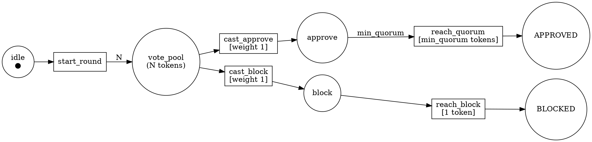

# Feature Research

**Domain:** Formal verification tooling for a multi-model AI quorum orchestration system (QGSD v0.12)
**Researched:** 2026-02-24
**Confidence:** HIGH for XState v5 patterns (official docs verified); HIGH for TLA+ invariant categories (academic consensus verified); MEDIUM for PRISM DTMC syntax (official docs reviewed, no direct QGSD analog found); MEDIUM for Alloy predicate patterns (Alloy 6.2.0 docs reviewed); LOW for Petri Net JS library fitness (npm ecosystem sparse, primary tools unmaintained)

---

## Context: What Is Already Built

This is a SUBSEQUENT MILESTONE. QGSD already has:

- Quorum orchestrator (`agents/qgsd-quorum-orchestrator.md`) — executes R3 protocol: provider pre-flight, team identity, sequential slot calls, deliberation rounds, APPROVE/BLOCK/CONSENSUS/ESCALATE verdict
- Sequential slot caller (`bin/call-quorum-slot.cjs`) — calls one quorum agent per invocation
- Scoreboard updater (`bin/update-scoreboard.cjs`) — persists TP/TN/FP/FN/TP+/UNAVAIL results per slot per round; composite `<slot>:<model-id>` key; category/subcategory fields
- Stop hook (`hooks/qgsd-stop.js`) — JSONL transcript scanner, quorum verification gate
- UserPromptSubmit hook (`hooks/qgsd-prompt.js`) — quorum injection into context
- Circuit breaker (`hooks/qgsd-circuit-breaker.js`) — oscillation detection via git history
- Activity sidecar (`.planning/current-activity.json`) — workflow stage tracking

The 6 features below are NEW for v0.12.

---

## Feature Landscape

### Table Stakes (Users Expect These)

Features any formal verification toolset must have to be considered credible. Missing these makes the tool feel like a demo rather than a real verification artifact.

| Feature | Why Expected | Complexity | Notes |
|---------|--------------|------------|-------|
| Conformance event logger with structured JSON schema | Any trace-checking system requires a well-defined event schema before TLA+ or XState validation can be applied. MongoDB's conformance checking found that defining state mapping was the hardest part — the schema must come first. | MEDIUM | Hooks (Stop, UserPromptSubmit, circuit breaker) emit events. Each event must have: `event_type`, `phase`, `timestamp_iso`, `session_id`, `task_id`, `slots_available`, `vote_result` (APPROVE/BLOCK/FLAG/UNAVAIL), `outcome`. Written to `.planning/conformance-events.jsonl` (append-only JSONL). The `validate-traces.cjs` CLI reads this file and checks each event against the valid state machine transitions. |
| TLA+ specification with named invariants | Any formal spec for a concurrent system must state what invariants TLC actually checks. Without named invariants, TLC runs but proves nothing specific. The three invariant categories (type, safety, liveness) are the consensus pattern across Paxos, Raft, ZooKeeper, BookKeeper specs. | HIGH | Three invariants to specify: (1) **TypeInvariant** — all variables hold valid types/ranges; (2) **MinQuorumMet** — no `APPROVE` verdict is emitted when fewer than `min_quorum_size` non-UNAVAIL votes exist (safety); (3) **PhaseMonotonicallyAdvances** — phase index never decreases (safety). One liveness property: **EventualConsensus** — every started quorum round eventually reaches a terminal state (APPROVE/BLOCK/CONSENSUS). TLC model checks with N=3 agents, min_quorum=2. |
| XState executable machine matching TLA+ phases | Spec-to-code drift is the main failure mode in formal verification programs. An XState machine that mirrors the TLA+ state graph makes the spec executable and testable in TypeScript, preventing drift. XState v5 is the current standard (released Dec 2023, required by TS 5.0+). | MEDIUM | 4 states: `IDLE` → `COLLECTING_VOTES` → `DELIBERATING` → `DECIDED`. Guards model quorum predicates: `minQuorumReached(context)` (≥ min_quorum_size non-UNAVAIL), `hasBlock(context)` (any BLOCK vote), `hasFlag(context)` (any FLAG without BLOCK). Typed via `setup()` + `createMachine()`. Shipped as `src/qgsd-machine.ts`, importable by tests. |
| CLI script shipped in `bin/` for trace validation | End users expect formal verification to ship as a runnable command, not just a spec file they have to know how to operate. The `validate-traces.cjs` script is the user-facing artifact of this entire milestone. | MEDIUM | `node bin/validate-traces.cjs [--events <path>] [--verbose]`. Reads `.planning/conformance-events.jsonl`, replays each event through the XState machine, reports any transition that violates the machine definition. Exit code 0 = all traces valid, 1 = violations found. Human-readable output: `[PASS] event 12: COLLECTING_VOTES → DELIBERATING`, `[FAIL] event 15: DECIDED → COLLECTING_VOTES (invalid transition)`. |

---

### Differentiators (Competitive Advantage)

Features that go beyond what any quorum system has formalized. No prior multi-model AI quorum system has TLA+ specs or probabilistic analysis — these are unique to QGSD v0.12.

| Feature | Value Proposition | Complexity | Notes |
|---------|-------------------|------------|-------|
| Alloy model for vote-counting validity | Alloy's bounded model checking generates *counterexamples* automatically — given N agents, M UNAVAIL, it finds whether any quorum count could be invalid under the vote-counting rules. This is not feasible with TLA+ (which checks temporal traces) or XState (which is a runtime). Alloy checks structural predicates independently of execution. | HIGH | Core predicate: `pred validTransition[approveCount, blockCount, flagCount, unavailCount, minQuorum: Int] { let totalVoting = approveCount + blockCount + flagCount | (totalVoting >= minQuorum) && (blockCount = 0) => approveCount >= minQuorum }`. Check command verifies no valid parameter combination produces an invalid quorum crossing. Alloy 6.2.0 (Jan 2025). Requires Alloy Analyzer JAR (Java). Spec file: `formal/quorum.als`. |
| PRISM probabilistic model from scoreboard data | No AI orchestration tool has published probability-of-consensus analysis from live operational data. PRISM takes a DTMC model parameterized with empirical UNAVAIL/TP rates and verifies `P>=0.95 [ F<=3 consensus_reached ]` — whether consensus within 3 rounds has ≥0.95 probability. This turns the scoreboard into a verification input, not just a dashboard. | HIGH | PRISM model: `dtmc` module with states per round, transitions weighted by slot's TP rate (from scoreboard) and UNAVAIL rate. `bin/export-prism-model.cjs` reads `quorum-scoreboard.json`, computes per-slot empirical UNAVAIL probability, generates a `.pm` model file. PRISM itself is a Java tool (CLI: `prism model.pm props.pctl`). Property file: `formal/quorum.pctl`. Key property: `P>=0.95 [ F<=3 consensus ]`. |
| Petri Net visualization of quorum token flow | Petri Net diagrams give a visual proof that the quorum threshold is deadlock-free for given N and min_quorum_size. Transitions fire only when the vote-place has enough tokens. Deadlock = no transition can fire = quorum stuck. This is the most communication-friendly artifact for non-formal-methods audiences. | MEDIUM | DOT format Petri Net generated by `bin/generate-petri-net.cjs`. Places: `idle`, `vote_pool`, `approved`, `blocked`, `deliberating`. Transitions: `start_round` (fires from `idle`, emits N tokens to `vote_pool`), `cast_approve` (consumes 1 token, adds to approve arc), `cast_block` (consumes 1 token, adds to block arc), `reach_quorum` (fires when approve_count ≥ min_quorum_size). Deadlock check: if vote_pool empties without `reach_quorum` or `reach_block` firing, deadlock state is reached. Rendered to SVG via Graphviz (DOT format). |

---

### Anti-Features (Commonly Requested, Often Problematic)

| Feature | Why Requested | Why Problematic | Alternative |
|---------|---------------|-----------------|-------------|
| Full TLA+ proof (not just TLC model checking) | "Model checking is incomplete — proofs cover all states" | Proofs require Isabelle/HOL or TLAPS and are an order of magnitude more effort. For a 4-phase quorum with N ≤ 10 agents, TLC model checking over finite N is complete enough. TLC with 3 agents and 3 rounds exhaustively checks the safety invariants. | TLC with explicit `CONSTANTS N = 3, MinQuorum = 2, MaxRounds = 3`. Enumerate all states. This is the MongoDB/Amazon/Microsoft approach for practical systems. |
| Monolithic TLA+ spec covering all QGSD behaviors | "One spec for everything — quorum + circuit breaker + activity tracking" | Monolithic specs cause state space explosion. MongoDB explicitly recommends "multiple focused specs" from their eXtreme Modelling work. A spec covering circuit breaker git history analysis would require modelling file system state — intractable for TLC. | One spec per subsystem: `formal/quorum.tla` (quorum protocol only). Circuit breaker and activity tracking are deferred to later milestones if desired. |
| Live runtime conformance checking (hook calls PRISM inline) | "Run PRISM verification on every quorum round automatically" | PRISM is a Java process with multi-second startup time. Calling it synchronously from a Stop hook (which must return in milliseconds to avoid blocking Claude) would cause timeout failures. | Offline analysis: `export-prism-model.cjs` + manual PRISM invocation. The conformance event log is generated live; analysis is run on-demand. |
| Colored Petri Nets for full agent identity modeling | "Model each agent slot individually with colored tokens" | Colored Petri Nets add the complexity of token colors (agent identities) to the state space. For deadlock detection, the structural property — does the threshold transition fire? — requires only ordinary Petri Nets. Agent identity is already modeled in TLA+. | Ordinary (Place/Transition) Petri Net with integer-weighted arcs. Deadlock detection is the goal, not agent simulation. |
| XState v4 (legacy) | "v4 has more community examples" | XState v4 is deprecated. v5 released December 2023 and is the current standard. v4 and v5 have different APIs (`createMachine` vs `setup().createMachine`, `guards` as inline functions vs parameterized objects). Mixed usage causes subtle bugs. | XState v5 exclusively. `setup()` + typed guards + `createMachine()`. TypeScript 5.0+ required. |
| npm-published Petri Net simulation library | "Use petri-js or petri-net npm package for simulation" | The npm Petri Net ecosystem is sparse and mostly unmaintained: `petri-net` (last publish 10 years ago), `petri-js` (no recent activity). Adding these as runtime dependencies creates maintenance debt for simulation features QGSD does not need. | DOT format output only: `bin/generate-petri-net.cjs` writes `.dot` files. Graphviz renders to SVG (`dot -Tsvg`). No npm Petri Net library dependency. Deadlock analysis is done analytically from the DOT structure, not via simulation. |

---

## Feature Dependencies

```
Conformance event logger (hooks emit JSONL)
    └──required by──> validate-traces.cjs (reads events, replays through XState machine)
    └──required by──> export-prism-model.cjs (reads scoreboard, not events — independent)

XState machine (src/qgsd-machine.ts)
    └──required by──> validate-traces.cjs (imports machine definition to replay events)
    └──mirrors──> TLA+ spec (same 4 states, same transition guards — must stay in sync)
    └──requires──> XState v5 (npm package "xstate" ≥5.0)

TLA+ spec (formal/quorum.tla)
    └──checked by──> TLC model checker (external Java tool, not shipped in bin/)
    └──informs──> Alloy model (same vote-counting rules modeled as predicates)
    └──MUST STAY IN SYNC WITH──> XState machine (same state names, same invariants)

Alloy model (formal/quorum.als)
    └──run by──> Alloy Analyzer JAR (external Java tool, not shipped in bin/)
    └──requires──> same vote counting logic as TLA+ spec (N, MinQuorum constants)
    └──is independent of──> conformance event logger (static structural check, not trace-based)

PRISM model generator (bin/export-prism-model.cjs)
    └──reads──> .planning/quorum-scoreboard.json (existing scoreboard data)
    └──writes──> formal/quorum.pm (PRISM model file)
    └──run by──> PRISM CLI (external Java tool, not shipped in bin/)
    └──is independent of──> conformance event logger (uses aggregated stats, not event traces)

Petri Net generator (bin/generate-petri-net.cjs)
    └──reads──> qgsd.json min_quorum_size + quorum_active slot count
    └──writes──> formal/quorum.dot (DOT format Petri Net)
    └──rendered by──> Graphviz CLI (external, `dot -Tsvg`)
    └──is independent of──> conformance event logger (structural model, not traces)

validate-traces.cjs (bin/)
    └──requires──> Conformance event logger (JSONL file must exist)
    └──requires──> XState machine (TypeScript, compiled or ts-node)
    └──ships in──> bin/ (user-facing CLI, installed globally)
```

### Dependency Notes

- **validate-traces.cjs is the only user-facing bin/ artifact.** The other generators (`export-prism-model.cjs`, `generate-petri-net.cjs`) also ship in `bin/` but are author/maintainer tools. TLA+, Alloy, and PRISM require external Java installations — they cannot be automated without Java on PATH.
- **XState machine must be compiled or run via ts-node.** `validate-traces.cjs` is a `.cjs` file; it cannot directly `import` TypeScript. Options: (a) compile `src/qgsd-machine.ts` to `src/qgsd-machine.cjs` as a build step; (b) use a plain JS re-export of the compiled machine. Decision: compile at install time or use `@xstate/compile` (no ts-node runtime dependency).
- **TLA+ and XState must stay in sync manually.** There is no automated spec-to-code code generation tool that maps TLA+ directly to XState. Divergence is a known pitfall (see PITFALLS.md). This is a process constraint, not a tool constraint.
- **PRISM model is parameterized by scoreboard empirical rates.** If scoreboard has no data (new install), PRISM model must fall back to theoretical defaults (UNAVAIL = 0.2, TP = 0.8). Document this fallback.

---

## MVP Definition

### Launch With (v0.12 — this milestone)

All 6 features are in scope. Priority order reflects the dependency chain — each feature unlocks the next.

- [ ] **Conformance event logger** — the data source everything else reads. Without events, validate-traces.cjs has nothing to check. Emit from Stop hook (quorum outcome) and optionally from the orchestrator (per-round votes).
- [ ] **validate-traces.cjs** — the user-facing bin/ script. Table stakes for the milestone to have user value.
- [ ] **XState TypeScript machine** — required by validate-traces.cjs. Also the executable form of the spec.
- [ ] **TLA+ spec with named invariants** — the formal ground truth. Must be written and TLC-verified before claiming formal verification.
- [ ] **Alloy model** — vote-counting structural check. Independent of trace data; can be developed in parallel with TLA+.
- [ ] **PRISM model generator + property file** — probabilistic analysis from scoreboard. Requires scoreboard data to be meaningful; can use defaults on new installs.
- [ ] **Petri Net generator** — DOT output. Lowest user risk; generates a visualization artifact. Can be written last as it has no code dependencies.

### Suggested Phase Split

Based on dependency chain and tool complexity:

**Phase v0.12-01 (event schema + XState + validate-traces):** Conformance event logger (JSONL schema + hook instrumentation), XState TypeScript machine (4 states, 3 guards), validate-traces.cjs (replay engine + CLI). These three are tightly coupled and must ship together.

**Phase v0.12-02 (TLA+ spec):** TLA+ specification file + TLC verification run. TLC model checker is an external tool (Java) — the phase deliverable is the `.tla` file and a documented TLC invocation that passes.

**Phase v0.12-03 (Alloy + PRISM + Petri Net):** All three static/probabilistic analysis tools in one phase. These are independent of the conformance event logger and can be developed and verified in parallel.

### Add After Validation (v0.12.x)

- [ ] **Continuous conformance CI** — run validate-traces.cjs in CI on every push, treating the event log from test runs as the trace input
- [ ] **XState Stately visualizer integration** — export machine JSON for https://stately.ai/viz visualization

### Future Consideration (v0.13+)

- [ ] **Circuit breaker TLA+ spec** — separate focused spec for the oscillation detection algorithm (deferred: requires modeling git history state, high complexity)
- [ ] **Probabilistic model with per-round degradation** — PRISM model that accounts for quota saturation over time (Gemini/Codex daily limits)

---

## Feature Prioritization Matrix

| Feature | User Value | Implementation Cost | Priority |
|---------|------------|---------------------|----------|
| Conformance event logger (JSONL schema + hook instrumentation) | HIGH — enables trace validation | MEDIUM — hooks already exist, needs emit calls added | P1 |
| validate-traces.cjs (user-facing CLI) | HIGH — only user-facing bin/ artifact of milestone | MEDIUM — XState replay + file read + report formatting | P1 |
| XState TypeScript machine | HIGH — eliminates spec-to-code drift | MEDIUM — 4 states, 3 guards, TypeScript 5 setup | P1 |
| TLA+ spec with named invariants | HIGH — the formal ground truth artifact | HIGH — TLA+ learning curve, TLC invocation, state space bounding | P1 |
| Alloy vote-counting model | MEDIUM — structural counterexample check | HIGH — Alloy language + Java dependency + predicate design | P2 |
| PRISM probabilistic model + generator | MEDIUM — scoreboard → probability property | HIGH — PRISM language + Java dependency + empirical rate mapping | P2 |
| Petri Net DOT generator | MEDIUM — visual deadlock communication artifact | LOW — DOT format generation, no external lib required | P2 |

**Priority key:**
- P1: Must have for the milestone to be "formal verification" rather than just documentation
- P2: Should have — the differentiating artifacts; without them the milestone is incomplete but functional

---

## Tool-by-Tool Specification

### 1. Conformance Event Logger

**What hooks emit:**

Every quorum outcome must be captured as a structured JSON event appended to `.planning/conformance-events.jsonl`.

Minimum event schema:
```json
{
  "schema_version": 1,
  "event_type": "quorum_outcome",
  "timestamp_iso": "2026-02-24T10:15:33.421Z",
  "session_id": "abc123",
  "task_id": "quick-99",
  "phase": "COLLECTING_VOTES",
  "slots_available": 4,
  "slots_total": 6,
  "votes": {
    "claude-1": "APPROVE",
    "gemini-cli-1": "BLOCK",
    "codex-cli-1": "UNAVAIL",
    "opencode-1": "APPROVE"
  },
  "vote_result": "BLOCK",
  "outcome": "BLOCK",
  "round": 1
}
```

**Where to emit:**
- Stop hook: emit once per planning command turn (outcome = final verdict from quorum evidence scan)
- Orchestrator agent: emit per round (can be post-processed from scoreboard writes, or emitted directly)

**File location:** `.planning/conformance-events.jsonl` (project-local, appended, not gitignored — the event log is a project artifact)

**Implementation:** `appendEvent(event)` function in `hooks/config-loader.js` or a new `hooks/conformance-logger.js` module that Stop hook and circuit breaker hook `require()`.

**Confidence:** MEDIUM — the schema is designed from first principles informed by MongoDB trace-checking and the existing scoreboard schema. No direct precedent for this exact format exists.

---

### 2. validate-traces.cjs

**Purpose:** User-facing CLI that reads the conformance event log and validates each event against the XState machine transition graph.

**CLI interface:**
```bash
node bin/validate-traces.cjs [--events <path>] [--verbose] [--json]
```

Defaults: `--events .planning/conformance-events.jsonl`

**Algorithm:**
1. Read JSONL file, parse all events
2. For each event, `send(machine, { type: event.event_type, ...event })` and check resulting state against expected state
3. Any transition that the XState machine rejects (guard fails, undefined transition) = violation
4. Report: per-event PASS/FAIL, summary count

**Output modes:**
- Human-readable (default): `[PASS] event 1 | IDLE → COLLECTING_VOTES`, `[FAIL] event 15 | DECIDED → COLLECTING_VOTES (no transition defined)`
- `--json`: machine-readable violation list for CI consumption
- `--verbose`: include full event payload in each line

**Exit codes:** 0 = no violations, 1 = violations found, 2 = file not found / parse error

**Install pattern:** Ships in `bin/`, installed to `~/.claude/qgsd-bin/` via `install.js`. Same `copyWithPathReplacement()` pattern as all other bin/ scripts.

**Confidence:** HIGH — XState v5 `interpret()` or `createActor()` + `send()` API is well-documented. The replay pattern is standard.

---

### 3. XState TypeScript Machine

**Purpose:** Executable formal model of QGSD's 4-phase quorum workflow. Acts as the verification oracle for validate-traces.cjs.

**States:**
- `IDLE` — no active quorum round
- `COLLECTING_VOTES` — round is open, votes being received
- `DELIBERATING` — vote threshold not met, additional round triggered
- `DECIDED` — terminal state (APPROVE or BLOCK outcome recorded)

**Guards (using XState v5 `setup()` pattern):**
```typescript
const machine = setup({
  types: {} as {
    context: QuorumContext;
    events: QuorumEvent;
  },
  guards: {
    minQuorumReached: ({ context }) =>
      context.votes.filter(v => v !== 'UNAVAIL').length >= context.minQuorumSize,
    hasBlock: ({ context }) =>
      context.votes.some(v => v === 'BLOCK'),
    hasFlag: ({ context }) =>
      context.votes.some(v => v === 'FLAG'),
    noProgressPossible: ({ context }) =>
      context.slotsAvailable < context.minQuorumSize,
  },
}).createMachine({ ... });
```

**Transitions:**
- `IDLE` + `START_ROUND` → `COLLECTING_VOTES`
- `COLLECTING_VOTES` + `CAST_VOTE` [minQuorumReached && !hasBlock] → `DECIDED` (APPROVE)
- `COLLECTING_VOTES` + `CAST_VOTE` [hasBlock] → `DECIDED` (BLOCK)
- `COLLECTING_VOTES` + `CAST_VOTE` [!minQuorumReached && !noProgressPossible] → `DELIBERATING`
- `DELIBERATING` + `START_ROUND` → `COLLECTING_VOTES`
- `DECIDED` → terminal (no outgoing transitions)

**TypeScript file:** `src/qgsd-machine.ts`. Compiled output: `src/qgsd-machine.js` (for CJS consumption by validate-traces.cjs).

**XState version:** v5 (current, released Dec 2023). `npm install xstate@5`. TypeScript ≥ 5.0 required.

**Confidence:** HIGH — XState v5 official docs confirmed. Guards, `setup()`, `createMachine()` patterns verified.

---

### 4. TLA+ Specification

**Purpose:** Formal ground truth that TLC model checker verifies. Defines what QGSD's quorum protocol guarantees.

**File:** `formal/quorum.tla`

**Constants (small model for TLC):**
```tla
CONSTANTS
  Slots,          \* e.g. {"s1", "s2", "s3"}
  MinQuorum,      \* e.g. 2
  MaxRounds       \* e.g. 3
```

**Variables:**
```tla
VARIABLES
  phase,          \* "IDLE" | "COLLECTING" | "DELIBERATING" | "DECIDED"
  votes,          \* function: Slots -> "APPROVE" | "BLOCK" | "FLAG" | "UNAVAIL" | "PENDING"
  round,          \* current round number (1..MaxRounds)
  outcome         \* "NONE" | "APPROVE" | "BLOCK"
```

**Key invariants to specify:**

1. **TypeInvariant** — all variables hold valid typed values. TLC checks this automatically if defined:
```tla
TypeInvariant ==
  /\ phase \in {"IDLE", "COLLECTING", "DELIBERATING", "DECIDED"}
  /\ round \in 1..MaxRounds
  /\ outcome \in {"NONE", "APPROVE", "BLOCK"}
  /\ \A s \in Slots: votes[s] \in {"APPROVE", "BLOCK", "FLAG", "UNAVAIL", "PENDING"}
```

2. **MinQuorumMet** (safety) — APPROVE outcome requires minimum quorum of non-UNAVAIL votes:
```tla
MinQuorumMet ==
  outcome = "APPROVE" =>
    Cardinality({s \in Slots: votes[s] = "APPROVE"}) >= MinQuorum
```

3. **PhaseMonotonicallyAdvances** (safety) — phase never goes backward (no DECIDED → COLLECTING regression):
```tla
PhaseOrder == {"IDLE" |-> 0, "COLLECTING" |-> 1, "DELIBERATING" |-> 2, "DECIDED" |-> 3}
PhaseMonotonicallyAdvances ==
  [][PhaseOrder[phase'] >= PhaseOrder[phase]]_phase
```

4. **EventualConsensus** (liveness) — system eventually reaches DECIDED state (requires fairness assumption on transitions):
```tla
EventualConsensus == <>(phase = "DECIDED")
```

**TLC invocation:**
```bash
java -jar tla2tools.jar -config formal/quorum.cfg -workers auto formal/quorum.tla
```

Config file `formal/quorum.cfg`:
```
CONSTANTS
  Slots <- {"s1", "s2", "s3"}
  MinQuorum <- 2
  MaxRounds <- 3
INVARIANT TypeInvariant
INVARIANT MinQuorumMet
PROPERTY EventualConsensus
```

**Known pitfall:** TLA+ state space explosion — `MaxRounds = 3` and `Slots` cardinality = 3 is the right bound for tractable TLC runs. Increasing either exponentially grows the state space.

**Confidence:** HIGH — TLA+ invariant categories (type, safety, liveness) are the consensus across Paxos/Raft/ZooKeeper academic literature. Syntax verified against learntla.com documentation.

---

### 5. Alloy Vote-Counting Model

**Purpose:** Structural predicate verification: given any combination of (N agents, M UNAVAIL, min_quorum), does the vote counting rule produce only valid outcomes? Counterexample generation finds edge cases TLA+ trace checking misses.

**File:** `formal/quorum.als`

**Core signatures:**
```alloy
sig Vote {}
one sig APPROVE, BLOCK, FLAG, UNAVAIL extends Vote {}

sig Round {
  votes: Slot -> one Vote,
  outcome: one Outcome
}

sig Slot {}
one sig Outcome {}
one sig APPROVED, BLOCKED, DELIBERATE extends Outcome {}
```

**Core predicate (vote-counting validity):**
```alloy
pred validOutcome[r: Round, minQ: Int] {
  let approving = {s: Slot | r.votes[s] = APPROVE} |
  let blocking = {s: Slot | r.votes[s] = BLOCK} |
  let voting = {s: Slot | r.votes[s] != UNAVAIL} |
    (r.outcome = APPROVED) iff
      (#voting >= minQ and #blocking = 0 and #approving >= minQ)
}
```

**Check command (assertion — must hold for all instances):**
```alloy
assert NoSpuriousApproval {
  all r: Round, minQ: Int |
    validOutcome[r, minQ] => r.outcome != APPROVED or
      #({s: Slot | r.votes[s] = APPROVE}) >= minQ
}
check NoSpuriousApproval for 5 but 3 Slot, 3 Int
```

**What Alloy Analyzer finds:** Any combination of vote counts and minQuorum value that produces an APPROVED outcome with fewer than minQuorum APPROVE votes. This catches off-by-one errors in the vote counting logic.

**Tool:** Alloy 6.2.0 (January 2025). Requires Java. Invoked via Alloy Analyzer GUI or CLI: `java -jar alloy6.jar formal/quorum.als`.

**Confidence:** MEDIUM — Alloy predicate logic patterns verified from haslab.github.io/formal-software-design. Vote-counting specific patterns are designed from first principles; no direct analog found in literature.

---

### 6. PRISM Probabilistic Model

**Purpose:** Verify probabilistic properties about QGSD consensus reliability derived from real scoreboard data: "With observed UNAVAIL and TP rates, does the quorum reach consensus within 3 rounds with ≥0.95 probability?"

**Generator script:** `bin/export-prism-model.cjs`

**What it reads:** `.planning/quorum-scoreboard.json` (existing file, written by `update-scoreboard.cjs`). Computes per-slot UNAVAIL rate = `unavail_count / total_rounds`.

**Generated model file:** `formal/quorum.pm` (PRISM DTMC model)

**PRISM model structure:**
```prism
dtmc

const int N = 4;           // quorum_active slot count
const int MIN_Q = 2;       // min_quorum_size

// Per-slot availability (empirical from scoreboard)
const double p_avail_s1 = 0.85;  // 1 - UNAVAIL_rate for slot claude-1
const double p_avail_s2 = 0.72;  // etc.
// ...

module quorum_round
  approvals : [0..N] init 0;
  blocks    : [0..N] init 0;
  round     : [0..3] init 0;
  done      : bool  init false;

  // Each slot independently casts a vote
  [] !done & approvals + blocks < N ->
     p_avail_s1 : (approvals' = approvals + 1) +
     (1 - p_avail_s1) : (round' = round);  // simplified
  // ... (one formula per slot)

  [] approvals >= MIN_Q & !done -> (done' = true);
endmodule

label "consensus" = done = true;
```

**Property file:** `formal/quorum.pctl`
```prism
// Probability of reaching consensus within 3 rounds
P>=0.95 [ F<=3 "consensus" ]

// Expected number of rounds to consensus
R{"rounds"}=? [ F "consensus" ]
```

**PRISM invocation:**
```bash
prism formal/quorum.pm formal/quorum.pctl
```

**Fallback if no scoreboard data:** Use theoretical defaults (UNAVAIL = 0.2 per slot, TP = 0.8). Document in generated file with a `// WARNING: using defaults` comment.

**Confidence:** MEDIUM — PRISM DTMC module syntax verified from prismmodelchecker.org documentation. The mapping from scoreboard rates to DTMC transition probabilities is designed from first principles; no direct prior art for this specific application was found.

---

### 7. Petri Net Generator

**Purpose:** Generate a visual DOT-format Petri Net showing how votes flow through the quorum threshold. Deadlock is visually detectable: if the `vote_pool` place empties without any terminal transition firing, the net is stuck.

**Generator script:** `bin/generate-petri-net.cjs`

**What it reads:** `qgsd.json` for `min_quorum_size` and `quorum_active` slot count.

**Generated file:** `formal/quorum.dot`

**DOT format structure:**


**Rendering:**
```bash
dot -Tsvg formal/quorum.dot -o formal/quorum.svg
```

Graphviz is an external tool. `generate-petri-net.cjs` writes the `.dot` file and prints the render command. Does NOT invoke Graphviz (to avoid hard dependency on external tool at runtime).

**Deadlock detection (analytical, not simulation):** The script checks analytically: if `N < min_quorum_size`, the `reach_quorum` transition can never fire (insufficient arc weight vs token count in `vote_pool`). Reports this as a deadlock warning.

**Confidence:** MEDIUM — DOT format Petri Net generation pattern is verified from Graphviz documentation and community examples. The `d3-graphviz` alternative (browser-based SVG rendering) is available but not needed since the output is a static file.

---

## Dependency Matrix: Existing Code Touchpoints

| Feature | Files Modified / Created | Pattern |
|---------|--------------------------|---------|
| Conformance event logger | `hooks/qgsd-stop.js` (emit call added), `hooks/config-loader.js` or new `hooks/conformance-logger.js` | Append JSONL to `.planning/conformance-events.jsonl` |
| validate-traces.cjs | `bin/validate-traces.cjs` (new), `bin/install.js` (add to install manifest) | Reads JSONL, imports XState machine, reports violations |
| XState machine | `src/qgsd-machine.ts` (new), `package.json` (add xstate dep), build step | TypeScript 5.0+, compiled to CJS for validate-traces |
| TLA+ spec | `formal/quorum.tla`, `formal/quorum.cfg` (new) | No Node.js dependency; external Java tool |
| Alloy model | `formal/quorum.als` (new) | No Node.js dependency; external Java + Alloy JAR |
| PRISM model generator | `bin/export-prism-model.cjs` (new), `formal/quorum.pctl` (new) | Reads quorum-scoreboard.json, generates quorum.pm |
| Petri Net generator | `bin/generate-petri-net.cjs` (new) | Reads qgsd.json, generates quorum.dot |

---

## Complexity Summary

| Feature | Phase Fit | Complexity | Reason |
|---------|-----------|------------|--------|
| Conformance event logger | v0.12-01 | MEDIUM | Hook modification + schema design; JSONL append is trivial |
| validate-traces.cjs | v0.12-01 | MEDIUM | XState actor API + file read + report; low novelty |
| XState machine | v0.12-01 | MEDIUM | TypeScript setup, guard design, state naming consensus with TLA+ |
| TLA+ spec | v0.12-02 | HIGH | New language (TLA+), TLC invocation, state space bounding required |
| Alloy model | v0.12-03 | HIGH | New language (Alloy), predicate design, Java dependency |
| PRISM probabilistic model | v0.12-03 | HIGH | New language (PRISM), empirical rate mapping, Java dependency |
| Petri Net generator | v0.12-03 | LOW | DOT format generation, analytical deadlock check |

---

## Sources

- `/Users/jonathanborduas/code/QGSD/agents/qgsd-quorum-orchestrator.md` — PRIMARY SOURCE. Quorum protocol phases, verdict types (APPROVE/BLOCK/CONSENSUS/ESCALATE), slot mechanics, scoreboard update pattern.
- `/Users/jonathanborduas/code/QGSD/bin/update-scoreboard.cjs` — PRIMARY SOURCE. TP/TN/FP/FN/TP+/UNAVAIL result codes, VALID_MODELS, VALID_VERDICTS, scoreboard schema.
- `/Users/jonathanborduas/code/QGSD/.planning/PROJECT.md` — PRIMARY SOURCE. v0.12 milestone goals and 6 target features confirmed.
- [MongoDB Conformance Checking Blog (2024)](https://www.mongodb.com/blog/post/engineering/conformance-checking-at-mongodb-testing-our-code-matches-our-tla-specs) — MEDIUM confidence. Trace-checking vs test-case generation tradeoffs. "Multiple focused specs" recommendation. State mapping complexity documented.
- [XState v5 Official Docs — Guards](https://stately.ai/docs/guards) — HIGH confidence. `setup()` API, parameterized guards, `and()`/`or()`/`not()` composition, TypeScript 5.0 requirement confirmed.
- [XState GitHub](https://github.com/statelyai/xstate) — HIGH confidence. v5 is current; v4 is deprecated. Zero dependencies.
- [Alloy 6.2.0 Release (January 2025)](https://alloytools.org/) — HIGH confidence. Version confirmed. Run vs check command semantics confirmed via haslab docs.
- [Alloy Formal Software Design — Overview](https://haslab.github.io/formal-software-design/overview/index.html) — HIGH confidence. `run` (satisfiability) vs `check` (validity/counterexample) semantics, predicate definitions, bounded model checking.
- [PRISM Probabilistic Model Checker](https://www.prismmodelchecker.org/) — HIGH confidence. DTMC/CTMC/MDP model types, PCTL property syntax (`P>=0.95 [...]`), reliability analysis use cases confirmed.
- [PRISM Property Specification — Syntax](https://www.prismmodelchecker.org/manual/PropertySpecification/SyntaxAndSemantics) — MEDIUM confidence. `P>=` and `P=?` operator syntax confirmed.
- [Jack Vanlightly — TLA+ Primer](https://jack-vanlightly.com/blog/2023/10/10/a-primer-on-formal-verification-and-tla) — MEDIUM confidence. Safety (invariants) vs liveness (temporal) property distinction, state space explosion pitfall, BFS model checking approach confirmed.
- [TLA+ Wikipedia](https://en.wikipedia.org/wiki/TLA+) — MEDIUM confidence. TLC model checker capabilities, constant/variable/action structure.
- [Validating Traces Against TLA+ (2024 arXiv)](https://arxiv.org/pdf/2404.16075v2) — LOW confidence (PDF unreadable by fetch tool). Title confirms trace validation from distributed program logs to TLA+ specs is an active 2024 research area.
- [d3-graphviz GitHub](https://github.com/magjac/d3-graphviz) — MEDIUM confidence. DOT format SVG rendering via WebAssembly Graphviz port. Confirms DOT is the correct output format for Petri Net visualization.
- [petri-js GitHub](https://github.com/kyouko-taiga/petri-js) — LOW confidence. Exists but no recent activity. Anti-feature: avoid as npm dependency.
- WebSearch: Petri net quorum deadlock patterns, PRISM consensus property examples, XState backend workflow examples — LOW confidence (WebSearch only, supporting direction).

---

*Feature research for: QGSD v0.12 — Formal Verification (6 new formal verification tools)*
*Researched: 2026-02-24*
